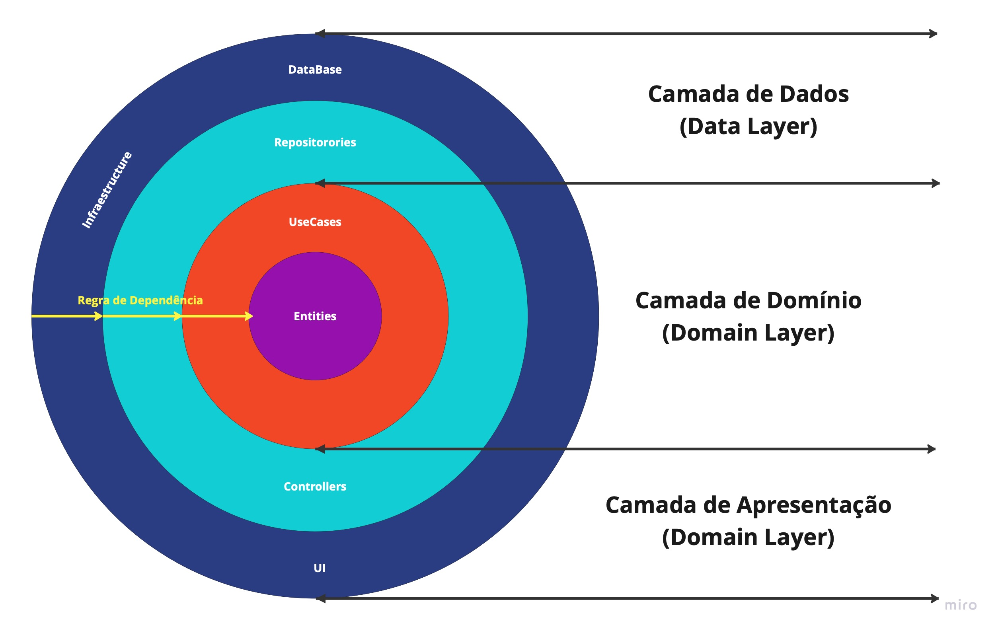

# Arquitetura do Projeto

O projeto adotará a Arquitetura Limpa (Clean Architecture) como padrão arquitetônico. O qual tem como objetivo favorecer a reusabilidade de código a independência de tecnologia e a testabilidade. Para tal, esse padrão dividi-se em camadas, conforme o gráfico abaixo.

## Camadas

**Domain Layer:** é a parte mais interna da estrutura (sem dependências de outras camadas, é totalmente isolada). Ele contém Entidades (Modelos de Negócios), Casos de Uso e Interfaces de Repositório.

**Presentation Layer:** é responsável por mostrar os dados ao usuário. 

**Data Layer:** contém implementações de repositórios e uma ou várias fontes de dados. Os Repositórios são responsáveis por coordenar dados das diferentes fontes de dados.

**Infra Layer:** é responsável por implementarinterfaces de frameworks. 

**Data Layer:** é responsável pela composição das rotas.

## Regras
 A principal regra da Arquitetura Limpa é não ter dependências das camadas internas às camadas externas. No gráfico, as setas em amarelo, apontando de fora para dentro, evidencia a regra da dependência, só pode haver dependências de camada externas para camadas internas. Caso haja necessidade podem ser criadas mais camadas na estrutua, de forma que as regras da Clean Architecture seja preservada. Desta forma optamos por adicionar mais duas camadas ao projeto, a Infra Layer e a Main Layer.

