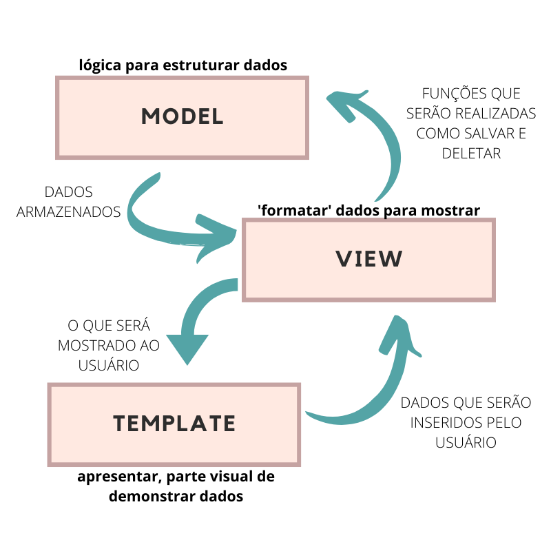

# Arquitetura MVC
A arquitetura MVC é uma forma de organizar o código de uma aplicação de software para torná-lo mais fácil de entender e manter. Ela divide o código em três partes diferentes: Modelo, Visão e Controlador.

O Modelo é responsável por lidar com os dados da aplicação e as regras de negócio. Por exemplo, se você estiver criando um aplicativo de compras, o Modelo é responsável por manter as informações sobre os produtos disponíveis para venda e realizar cálculos de preços.

A Visão é o que o usuário vê na tela. É responsável por exibir informações para o usuário e permitir que ele interaja com a aplicação, como escolher um produto para comprar.

O Controlador é o intermediário entre o Modelo e a Visão. Ele recebe as ações do usuário, manipula os dados com o Modelo e atualiza a Visão. Por exemplo, se o usuário clicar em um botão para comprar um produto, o Controlador é responsável por realizar a ação de compra e atualizar a tela para mostrar ao usuário o resultado da compra.

Ao usar a arquitetura MVC, o desenvolvedor pode trabalhar em cada parte do código de forma independente, tornando o desenvolvimento mais eficiente e fácil de manter. Além disso, a divisão clara dessas partes permite que diferentes equipes trabalhem juntas sem se interferirem mutuamente.

Segue imagem para visualização:

## Como foi implementado

 - Definimos a camada de modelo: criamos uma classe ou conjunto de classes que representavam os dados e a lógica de negócios da aplicação.

 - Definimos a camada de visão: criamos uma classe ou conjunto de classes que representavam a interface da aplicação e forneciam informações ao usuário.

 - Definimos a camada de controlador: criamos uma classe ou conjunto de classes que controlavam a comunicação entre o modelo e a visão e processavam as ações do usuário.

 - Conectamos as camadas: estabelecemos as conexões entre as camadas de modelo, visão e controlador para que as informações pudessem ser transmitidas de maneira adequada.

 - Testamos a implementação: verificamos se o MVC estava funcionando corretamente, testando a aplicação em diferentes cenários.

