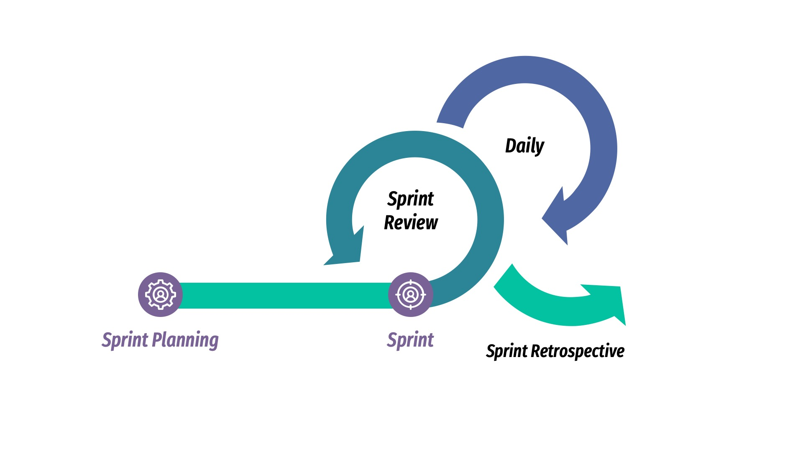
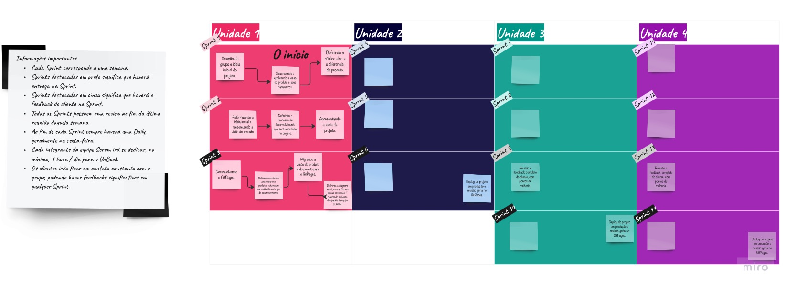

# Processo de Desenvolvimento de Software
Para o desenvolvimento do projeto iremos utilizar as metodologias Scrum e XP (Extreme Programming) com ciclos de entregas rápidas e incrementais. Abaixo seguem as principais características que usaremos de cada um dos métodos.

- ###Tópicos SCRUM
    - **Daily Sprints** - Realizadas diariamente, para que os membros da equipe possam se comunicar (preferencialmente pelo WhatsApp) e se atualizar sobre o andamento do projeto.
    - **Sprint Planning** - realizada no início de cada sprint, para que os membros da equipe possam se reunir e planejar o que será feito na sprint.
       -Entrega: Sprint Backlog
    - **Sprint Review** - realizada no final de cada sprint, para que os membros da equipe possam revisar o que foi feito na sprint.
        -Entrega: Documento informando o que foi atigindo durante a sprint. 
    - **Sprint Retrospective** - realizada no final de cada sprint, para que os membros da equipe possam refletir sobre o que foi feito na sprint e o que pode ser melhorado para as próximas sprints.
        -Entrega: Documento informando os pontos que acreditamos que devemos melhorar para a próxima sprint e pontos positivos que devemos manter.
    - **Product Backlog** - É uma lista de funcionalidades que o produto deve ter, ordenadas de acordo com a importância para o cliente. As funcionalidades são adicionadas ao Product Backlog durante o Sprint Planning.

- ###Tópicos eXtreme Programming
    - **Pair Programming** - É uma técnica de programação em que dois programadores trabalham juntos em um mesmo computador. Um dos programadores (o driver) escreve o código enquanto o outro (o observer) observa e sugere melhorias.
    - **Test Driven Development** - É uma técnica de desenvolvimento de software que consiste em escrever testes antes de escrever o código. Os testes são escritos para especificar e validar o comportamento do código.
    - **Continuous Integration** - É uma prática de desenvolvimento de software que consiste em integrar o código desenvolvido por diferentes programadores dirigida a entregas. Cada integração é verificada por um processo de integração contínua, que pode incluir compilação, execução de testes e notificação de desenvolvedores sobre falhas.
    - **Plannig Poker** - É uma técnica de estimativa de esforço de desenvolvimento de software que consiste em uma equipe de desenvolvimento estimar o esforço necessário para completar uma tarefa.

- ###Como utilizaremos as duas técnicas
    - **Sprint Planning e Plannig Poker** - utilizaremos o Plannig Poker durante Sprint Planning para gerenciar as tarefas mais pertinentes a serem feitas.
    - **Sprints unidas a técnicas do XP** - para a realização das sprints utilizaremos as técnicas provenientes do XP, como Pair Programing, TDD, Continuous Integration para o desenvolvimento dos códigos.

[Para melhor visualização, clique aqui](https://miro.com/app/board/uXjVPCowwHI=/?share_link_id=182985375355)
